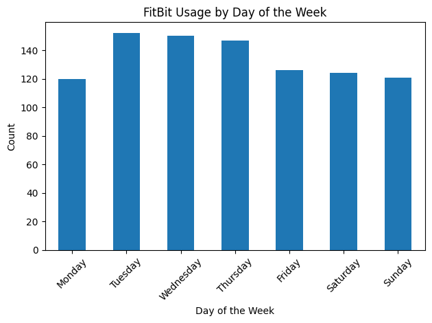
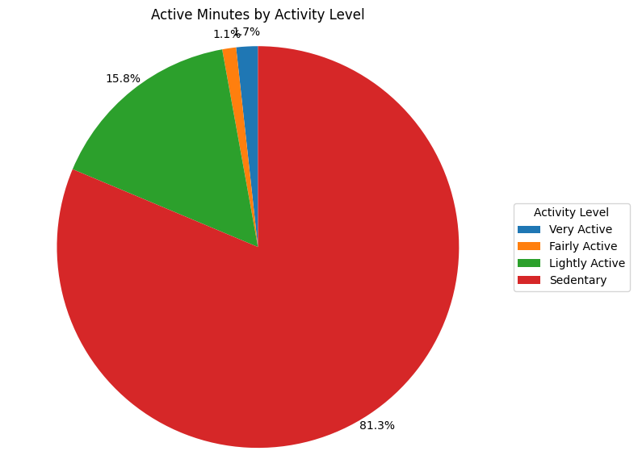
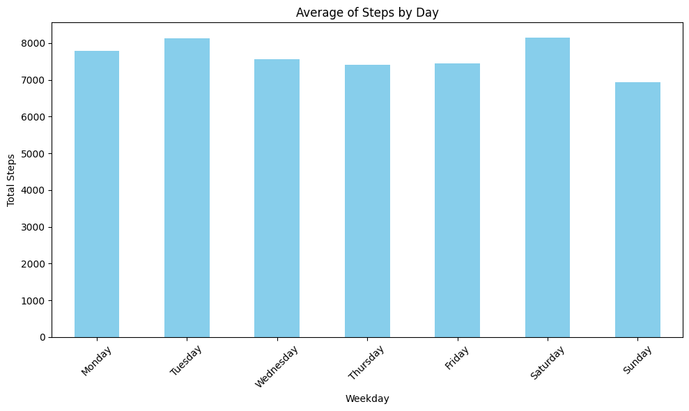
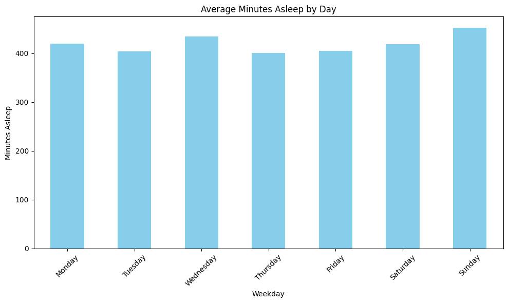
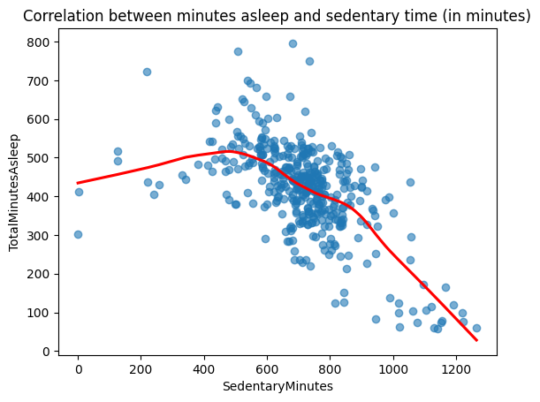
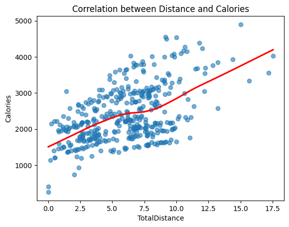
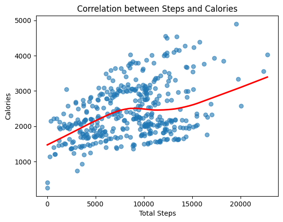
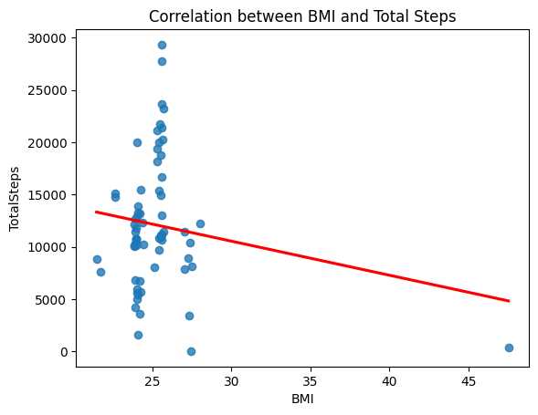

# Google Analytics Capstone Project: Bellabeat Case Study

**Author:** Nathaly Pichilingue

This repository includes a Colab notebook, that you can found [here](https://colab.research.google.com/drive/1pfJdlV68Li0UDRyh-0MqjGFlp0-EVAX_?usp=sharing)

This repository covers the resolution of the Bellabeat Case Study on the Google Data Analytics Capstone Project.

We follow the six data analytics steps.

## Process

1. [Ask](#Ask)
2. [Prepare](#Prepare)
3. [Process](#Process)
4. [Analyze](#Analyze)
5. [Share](#Share)
6. [Act](#Act)

## Summary

Bellabeat was founded in 2013 as a tech company that creates intelligent products focused on wellness. Since its foundation, it has grown rapidly and positioned itself as a tech-driven wellness company for women. They offer five main products: the Bellabeat App, Leaf (a smart bracelet), Time (a smartwatch), Spring (a smart water bottle), and Memberships.

Although they are already a successful company, they have the potential to become a major player in the smart device market. That’s why our team has been asked to analyze data from smart devices to gain insights into how consumers are using them. The insights we gather will help guide Bellabeat’s marketing strategy and identify opportunities for growth.


## Ask

Our bussiness task is to analyze Fitbit data to gain insight and help Bellabeat make marketing strategies for growth.

Our primary stakeholders are Urška Sršen and Sando Mur, executives members of Bellabeat

And our secondary stakeholders are the Bellabeat marketing analytics team.

## Prepare

Our Data Source is the FitBit Fitness Tracker Data by Mobius.

Then, we find if it applies to the ROCCC concept:

- Reliability: The data is from 30 FitBit Users, respondents of a survey via Amazon Mechanical Turk, who consented the submission of their personal tracker data.

- Original: The source is Amazon Mechanical Turk, so we count it as a third-party source.

- Comprehensive: Hello

- Current: Data is from March 2016 to May 2016. To the time of this presentation, the data is outdated.

- Cited: It's unknown

When preparing the data, we found some limitacions:

- Data it's from only 30 users. For this type of analysis, more data is prefered.
- Checking the data, we found the 30 users logged dailt activity data, but only 24 users recorded their sleep data and even only 8 users recorded their weight info. We also found 3 duplicates.

## Process

We start examinating the data, and checking for NA or null values, and duplicates. We used Python on a Jupyter Noteebook for this.

```python
daily_activity_df.info()
sleep_day_df.info()
weight_info_log_df.info()

weight_info_log_df = weight_info_log_df.drop('Fat',axis=1)
sleep_day_df = sleep_day_df.drop_duplicates()
```

We also make some converts to Datetime and separate Date from Time

```python
sleep_day_df['SleepDay'] = pd.to_datetime(sleep_day_df['SleepDay'])

weight_info_log_df['Time'] = weight_info_log_df['Date'].dt.time
```

We start looking if all the users are registering all their data, or not, we use the .unique() method to do so

```python
unique_count_act = len(daily_activity_df['Id'].unique())
unique_count_sl = len(sleep_day_df['Id'].unique())
unique_count_we = len(weight_info_log_df['Id'].unique())
```
We can see that not all the users are recording all the data, there's 33 user data for daily activity, 24 users data for sleep activity and only 8 for weight info.

With that, we pass to analyze the data.

## Analyze

We made a summary on all of our data

```python
daily_act_summary = daily_activity_df.describe()
daily_act_summary = daily_act_summary.transpose()

sleep_day_summary = sleep_day_df.describe()
sleep_day_summary = sleep_day_summary.transpose()

weight_info_summary = weight_info_log_df.describe()
weight_info_summary = weight_info_summary.transpose()
```

And now we observe the results:

- For daily activity:
  
|index|count|mean|min|25%|50%|75%|max|std|
|---|---|---|---|---|---|---|---|---|
|Id|940\.0|4855407369\.332978|1503960366|2320127002|4445114986|6962181067|8877689391|2424805475\.657955|
|ActivityDate|940|2016-04-26 06:53:37\.021276672|2016-04-12 00:00:00|2016-04-19 00:00:00|2016-04-26 00:00:00|2016-05-04 00:00:00|2016-05-12 00:00:00|NaN|
|TotalSteps|940\.0|7637\.9106382978725|0|3789\.75|7405\.5|10727|36019|5087\.150741753409|
|TotalDistance|940\.0|5\.489702121915415|0|2\.61999988555908|5\.24499988555908|7\.71249997615814|28\.0300006866455|3\.924605908624871|
|TrackerDistance|940\.0|5\.475351057821845|0|2\.61999988555908|5\.24499988555908|7\.71000003814697|28\.0300006866455|3\.9072759432009443|
|LoggedActivitiesDistance|940\.0|0\.10817093988682361|0|0|0|0|4\.94214200973511|0\.6198965182108744|
|VeryActiveDistance|940\.0|1\.502680850999945|0|0|0\.209999993443489|2\.0524999499321|21\.9200000762939|2\.6589411648346166|
|ModeratelyActiveDistance|940\.0|0\.5675425513706943|0|0|0\.239999994635582|0\.800000011920929|6\.48000001907349|0\.883580319140428|
|LightActiveDistance|940\.0|3\.3408191485885292|0|1\.9450000226497675|3\.364999890327455|4\.78250014781952|10\.710000038147|2\.04065538820603|
|SedentaryActiveDistance|940\.0|0\.0016063829566887052|0|0|0|0|0\.109999999403954|0\.007346176286859482|
|VeryActiveMinutes|940\.0|21\.164893617021278|0|0|4|32|210|32\.84480305692363|
|FairlyActiveMinutes|940\.0|13\.564893617021276|0|0|6|19|143|19\.987403953867602|
|LightlyActiveMinutes|940\.0|192\.8127659574468|0|127|199|264|518|109\.17469975147056|
|SedentaryMinutes|940\.0|991\.2106382978724|0|729\.75|1057\.5|1229\.5|1440|301\.2674367904795|
|Calories|940\.0|2303\.609574468085|0|1828\.5|2134|2793\.25|4900|718\.1668621342561|

- For sleep info:

|index|count|mean|min|25%|50%|75%|max|std|
|---|---|---|---|---|---|---|---|---|
|Id|410\.0|4994963040\.965854|1503960366|3977333714|4702921684|6962181067|8792009665|2060863238\.1315188|
|SleepDay|410|2016-04-26 11:38:55\.609756160|2016-04-12 00:00:00|2016-04-19 00:00:00|2016-04-27 00:00:00|2016-05-04 00:00:00|2016-05-12 00:00:00|NaN|
|TotalSleepRecords|410\.0|1\.1195121951219513|1|1|1|1|3|0\.34663560215622835|
|TotalMinutesAsleep|410\.0|419\.17317073170733|58|361|432\.5|490|796|118\.63591758410313|
|TotalTimeInBed|410\.0|458\.4829268292683|61|403\.75|463|526|961|127\.45513981879806|

- For weight info:

|index|count|mean|min|25%|50%|75%|max|std|
|---|---|---|---|---|---|---|---|---|
|Id|67\.0|7009282134\.656716|1503960366|6962181067|6962181067|8877689391|8877689391|1950321943\.9151962|
|Date|67|2016-04-26 22:12:32\.238806016|2016-04-12 00:00:00|2016-04-19 00:00:00|2016-04-27 00:00:00|2016-05-04 00:00:00|2016-05-12 00:00:00|NaN|
|WeightKg|67\.0|72\.03582137378294|52\.5999984741211|61\.4000015258789|62\.5|85\.04999923706055|133\.5|13\.923206254615446|
|WeightPounds|67\.0|158\.81180138418762|115\.963146545323|135\.363832345577|137\.788913865625|187\.503152306349|294\.317120016975|30\.69541547760857|
|BMI|67\.0|25\.185223792915913|21\.4500007629395|23\.9599990844727|24\.3899993896484|25\.5599994659424|47\.5400009155273|3\.066962577719134|
|LogId|67\.0|1461771594283\.582|1460443631000|1461079185000|1461801599000|1462375450500|1463097599000|782994783\.6092505|

#### Daily Activity
- On average, users take **7,637.9 steps per day**.
- The **average calorie expenditure** is approximately **2,303 kcal**.
- Users spend a large portion of their day being sedentary, with a **mean of 991 sedentary minutes**, which is over 16 hours.
- The average distance tracked is about **5.49 km per day**.
- Very active minutes average only **21 minutes per day**, suggesting users could benefit from encouragement to be more physically active.

#### Sleep
- Users sleep an average of **419.2 minutes per night** (roughly 7 hours).
- The **average time in bed** is about **458.5 minutes**, showing a small gap between time in bed and actual sleep time.
- Most users log only **one sleep session per night**, indicating consistent overnight tracking.

#### Weight and BMI
- The **average weight** among users is **72.04 kg** (158.8 lbs).
- The **average BMI** is **25.18**, which falls into the **overweight** category according to CDC guidelines (BMI 25.0 – 29.9).
- The dataset for weight and BMI is more limited in size (only 67 records), so this insight may not be representative of the full user base.

---

#### Key Observations
- According to the CDC, a goal of **10,000 daily steps** is recommended for adults. The average here (7,637 steps) suggests that **users are moderately active but fall short of this benchmark**.
- With **high sedentary time** and **low active minutes**, Bellabeat users could benefit from features that encourage regular movement throughout the day.
- **Sleep duration is relatively healthy**, averaging around 7 hours, although variability exists.

These summary statistics provide a foundation to generate actionable insights in the next phases of the analysis.


## Share

We aim to see some trends and if there are any relationships.

### FitBit Daily Usage

We created a new column called `'Weekday'` by extracting the day of the week from the `ActivityDate` column:

```python
daily_activity_df['Weekday'] = daily_activity_df['ActivityDate'].dt.day_name()
```

And then, we counted Weekday values and got this graph:



The data shows that **FitBit usage is highest from Tuesday to Thursday**, which corresponds to the middle of the week. This could indicate that users are more motivated to track their activity during these days. In contrast, **Monday shows slightly lower usage**, possibly because users are just getting back into their weekly routines and may feel less motivated to be active.
### Active Minutes by Level of Activity

We summed the total minutes for each activity level and plotted them in a pie chart to visualize the percentage of time spent in each category.



As shown in the pie chart, **Sedentary Minutes** account for the largest proportion, representing approximately **81.3%** of total recorded time. This high percentage may be associated with daily work routines, such as office jobs, or general lifestyle habits like watching TV, reading, or doing household tasks that involve minimal movement.

### Average of steps by day

We get the mean of steps taken by day, and plot into a bar graph to see the average steps taken by day



#### Average steps values per day

> Weekday
> 
> Monday       7780.866667
> 
> Tuesday      8125.006579
> 
> Wednesday    7559.373333
> 
> Thursday     7405.836735
> 
> Friday       7448.230159
> 
> Saturday     8152.975806
> 
> Sunday       6933.231405
> 
> Name: TotalSteps, dtype: float64


We can observe that users tend to take more steps on **Saturday**, **Tuesday**, and **Wednesday**. The higher activity on Tuesday and Wednesday aligns with the previously observed patterns of increased device usage during weekdays. The spike on Saturday may indicate that users are more active during weekends, possibly because they are free from work or daily routines and have more time for outdoor activities.

### Average Minutes Asleep by Day of Week

We get the mean of minutes asleep taken by day, and plot into a bar graph to see the average minutes asleep by day.



#### Average Minutes Asleep Values by Day of Week

> 
> Monday       419.500000
> 
> Tuesday      404.538462
> 
> Wednesday    434.681818
> 
> Thursday     401.296875
> 
> Friday       405.421053
> 
> Saturday     419.070175
> 
> Sunday       452.745455
> 
> Name: TotalMinutesAsleep, dtype: float64

We observe that users tend to sleep the most on **Sundays** and **Wednesdays**, while **Thursdays** have the lowest average sleep duration. This may suggest that users try to recover sleep on Sundays before starting the week, and that midweek rest peaks on Wednesday.

### Correlation between minutes asleep and sedentary time



```python
sleep_sedentary_cor_val = merged_data_daily_act_sleep_day[
    ['Id', 'ActivityDate', 'TotalTimeInBed', 'TotalMinutesAsleep', 'SedentaryMinutes']
].corr()
print(sleep_sedentary_cor_val)
```

> Corr. value between TotalMinutesAsleep and SedentaryMinutes: -0.601073  

After reviewing individual records, it became clear that `SedentaryMinutes` and `TotalMinutesAsleep` are measured separately in the dataset. For example, in one case, a user recorded over 1,200 sedentary minutes but less than 100 minutes of sleep. This suggests that sleep time is not automatically included in sedentary time by the device.

Given this, the negative correlation observed between the two variables (-0.601) appears to reflect a real behavioral pattern: users who are more sedentary during the day tend to sleep less at night.

### Correlation between Distance and Calories




The correlation between `TotalDistance` and `Calories` is approximately **0.52**, indicating a moderate positive relationship. This suggests that users who walk or run longer distances tend to burn more calories throughout the day.

While not a perfect correlation, it aligns with expectations, as covering more distance typically requires greater energy expenditure. Other factors such as workout intensity, body weight, and metabolism may also influence total calories burned.

### Correlation between Steps and Calories



The correlation between `TotalSteps` and `Calories` is approximately **0.41**, indicating a moderate positive relationship. This means that users who take more steps during the day tend to burn more calories.

While the relationship is not extremely strong, it still supports the general idea that higher step counts contribute to greater energy expenditure. However, other factors such as activity intensity, user weight, and duration of movement likely also influence the total calories burned.

#### Comparing Total Steps and Total Distance vs Calories

When analyzing the relationship between physical activity and energy expenditure, both `TotalSteps` and `TotalDistance` show positive correlations with `Calories`.

- `TotalSteps` vs `Calories`: **0.41**
- `TotalDistance` vs `Calories`: **0.52**

Although both metrics are related to movement, distance shows a stronger correlation with calories burned. This suggests that not just the quantity of steps, but the actual distance covered (and likely intensity) plays a more significant role in determining how many calories are burned during the day.


### Correlation between BMI and Total Steps



The correlation between `BMI` and `TotalSteps` is approximately **-0.16**, indicating a weak negative relationship. This suggests that users who walk more tend to have slightly lower BMI values.

Although the relationship is not strong, it aligns with general health trends that associate higher physical activity levels with lower body mass index. It's important to note that BMI is influenced by many factors beyond daily step count, such as diet, metabolism, and body composition.


## Act

Based on the analysis of the Fitbit data, the following recommendations could help Bellabeat improve user engagement, promote healthy habits, and better tailor their product features:

1. **Encourage More Daily Activity**  
   The data shows that users with higher step counts and more active minutes tend to burn more calories and have slightly lower BMI. Bellabeat could implement daily step goals, personalized activity challenges, or in-app rewards to motivate users to stay active.

2. **Focus on Sleep Quality Insights**  
   There is a strong positive correlation between time in bed and minutes asleep. Bellabeat could enhance its sleep tracking features by providing users with tailored sleep tips, bedtime routines, or sleep efficiency scores to promote better rest. Additionally, Bellabeat could take advantage of weekly sleep trends by sending gentle reminders or wellness suggestions on days when users typically sleep less, such as Thursdays, helping them maintain more consistent sleep habits throughout the week.

3. **Address Sedentary Behavior**  
   A noticeable negative correlation was found between sedentary time and sleep duration. Bellabeat could include features that alert users when they’ve been inactive for too long, or encourage short breaks throughout the day with stretch or mindfulness reminders.

4. **Personalize Calorie Burn Feedback**  
   Since calorie burn correlates better with total distance than with step count, Bellabeat might improve its tracking by highlighting distance and activity intensity in addition to just steps. This could give users a clearer picture of how their movement impacts energy expenditure.

5. **Segment and Target Users Based on Patterns**  
   Weekly patterns show that users are typically more active on weekdays than weekends. Bellabeat could use this insight to deliver motivational content or push notifications during weekends when activity tends to drop.

By implementing these data-driven recommendations, Bellabeat can offer more value to its users, foster healthier habits, and differentiate itself in the competitive wellness app market.
